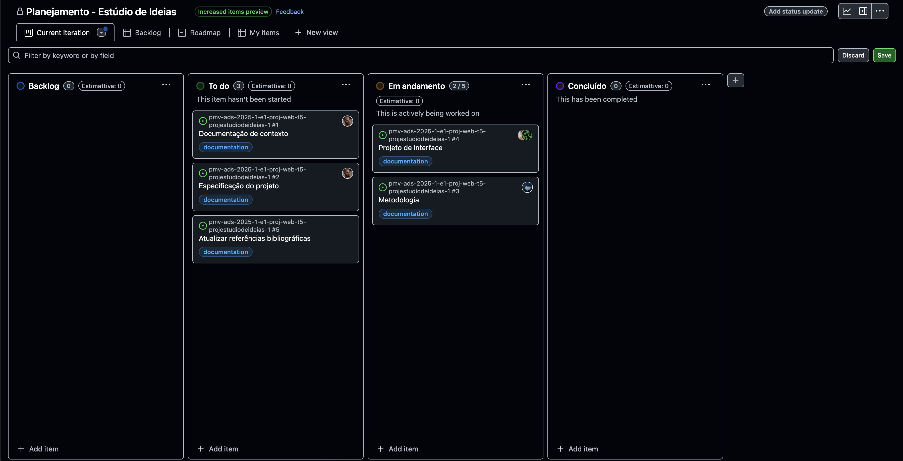
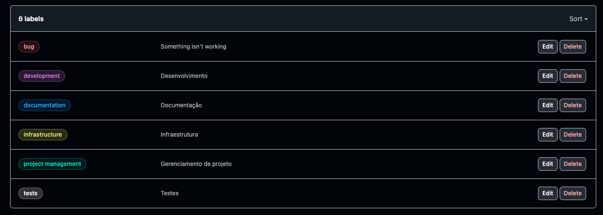

# Metodologia

Esta seção descreve a organização da equipe para a execução das tarefas do projeto e as ferramentas utilizadas para a manutenção dos códigos e demais artefatos.

## Gerenciamento de Projeto
A metodologia ágil escolhida para o desenvolvimento deste projeto foi o SCRUM, pois como citam Amaral, Fleury e Isoni (2019, p. 68):

> "visão clara dos resultados a entregar; ritmo e disciplina necessários à execução; definição de papéis e responsabilidades dos integrantes do projeto (Scrum Owner, Scrum Master e Team); empoderamento dos membros da equipe de projetos para atingir o desafio; conhecimento distribuído e compartilhado de forma colaborativa; ambiência favorável para crítica às ideias e não às pessoas."

### Divisão de Papéis
Em times SCRUM, é comum atribuir papéis que definem responsabilidades e atividades a serem executadas por seus integrantes. Por se tratar de um time multidisciplinar, a atribuição desses papéis é importante para garantir a organização e preservar a agilidade da equipe. O time está organizado da seguinte maneira:

- Scrum Master: Maicon Theodoro;
- Product Owner: Allan Rodrigues;
- Desenvolvedores: Allan Rodrigues, Eduardo Moreira, Hugo Vaz, Maicon Theodoro e Vinícius Silva;
- Designers: Allan Rodrigues, Eduardo Moreira, Hugo Vaz, Maicon Theodoro e Vinícius Silva.

### Processo
As atividades previstas, planejadas, em andamento e finalizadas são documentadas no GitHub Projects. Assim, é possível estabelecer uma lista de atividades a serem realizadas, definir prioridades, responsáveis e rastrear o andamento de cada tarefa. As listas são divididas em:

- Backlog: recebe as tarefas a serem trabalhadas e representa o Product Backlog. Todas as atividades identificadas no decorrer do projeto também devem ser incorporadas à esta lista;
- To do: esta lista representa o Sprint Backlog. Este é o Sprint atual que estamos trabalhando.;
- Em andamento: quando uma tarefa tiver sido iniciada, ela é movida para cá;
- Concluído: nesta lista são colocadas as tarefas que passaram pelos testes e controle de qualidade e estão prontos para ser entregues ao usuário. Não há mais edições ou revisões necessárias, ele está agendado e pronto para a ação.

<figure> 
  
  <figcaption>Figura 1 - Quadro Kanban utilizado no Github Projects</figcaption>
</figure> 

### Etiquetas

As tarefas são etiquetadas em função da natureza da atividade e seguem o seguinte esquema de cores/categorias:

<ul>
  <li>Bug (erro no código)</li>
  <li>Desenvolvimento (development)</li>
  <li>Documentação (documentation)</li>
  <li>Gerência de Projetos (project management)</li>
  <li>Infraestrutura (infrastructure)</li>
  <li>Testes (tests)</li></ul>

<figure> 
  
  <figcaption>Figura 2 - Etiquetas disponíveis</figcaption>
</figure> 
  
### Ferramentas
O projeto recomenda a utilização de uma série de aplicações e ferramentas a fim de padronizar, simplificar e otimizar os processos adotados pela equipe. São elas:

- Editores de código modernos;
- Aplicação para comunicação via texto, voz e vídeo;
- Ferramenta para desenhar fluxogramas.

Os artefatos do projeto são desenvolvidos a partir de diversas plataformas e a relação dos ambientes com seu respectivo propósito é apresentada na tabela que se segue.

| AMBIENTE                            | PLATAFORMA                         | LINK DE ACESSO                         |
|-------------------------------------|------------------------------------|----------------------------------------|
| Repositório de código fonte         | GitHub                             | https://github.com/ICEI-PUC-Minas-PMV-ADS/pmv-ads-2025-1-e1-proj-web-t5-projestudiodeideias-1/tree/main                            |
| Documentos do projeto               | GitHub                             | https://github.com/ICEI-PUC-Minas-PMV-ADS/pmv-ads-2025-1-e1-proj-web-t5-projestudiodeideias-1/blob/main/README.md                            |
| Projeto de interface                | Mermaid e Figma                              | ...                            |
| Gerenciamento do projeto            | GitHub Projects                    | https://github.com/orgs/ICEI-PUC-Minas-PMV-ADS/projects/1983                            |
| Comunicação                          | Microsoft Teams                          | [Canal G4_20_00h / Microsoft Teams](https://teams.microsoft.com/l/channel/19%3A3c14c478c8ba461a9f9eedb9987fc321%40thread.tacv2/G4_20_00h?groupId=a5b2bd83-b94d-46d3-b134-f95a5060d710&tenantId=14cbd5a7-ec94-46ba-b314-cc0fc972a161&ngc=true) |

### Estratégia de Organização de Codificação 

Todos os artefatos relacionados a implementação e visualização dos conteúdos do projeto do site deverão ser inseridos na pasta [codigo-fonte](https://github.com/ICEI-PUC-Minas-PMV-ADS/pmv-ads-2025-1-e1-proj-web-t5-projestudiodeideias-1/tree/main/codigo-fonte). 
