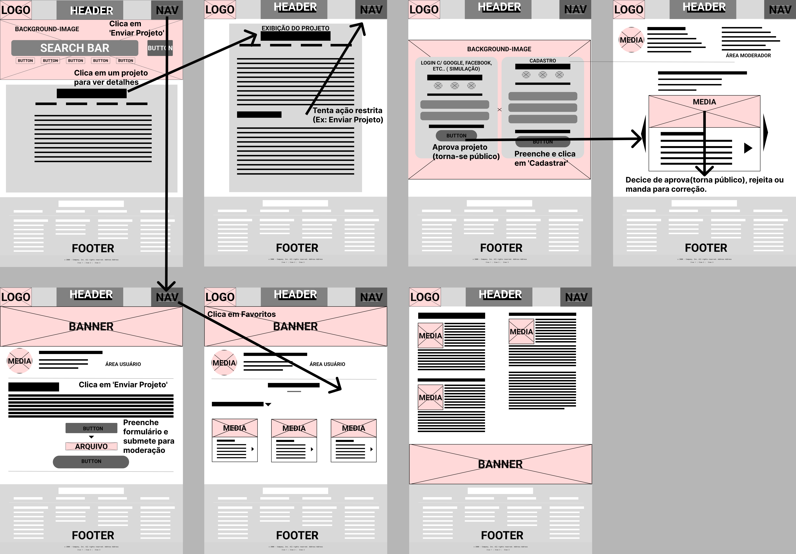
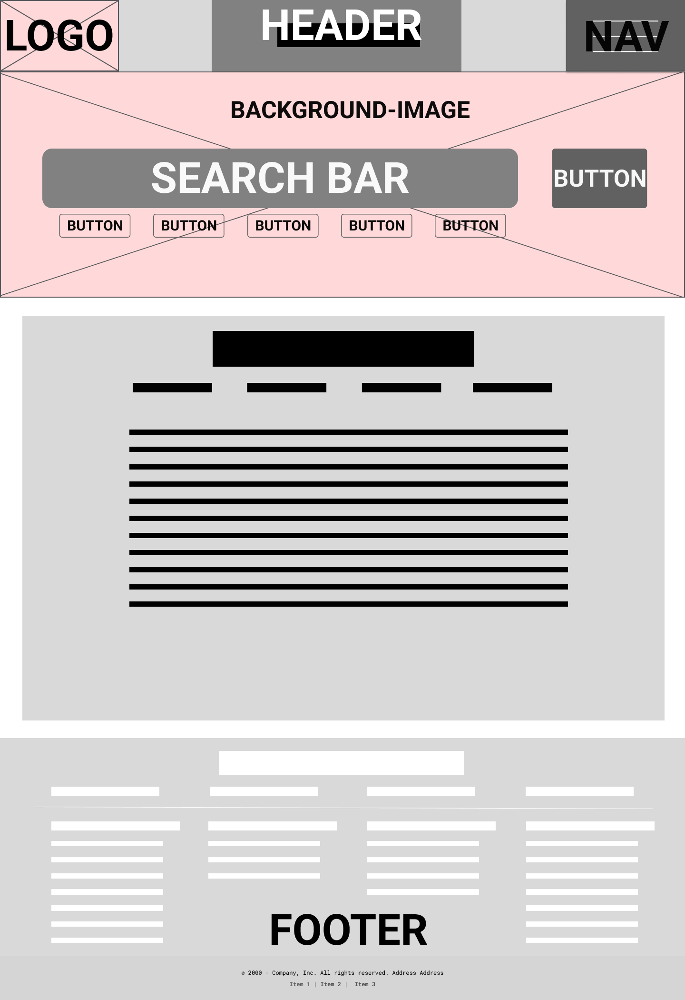
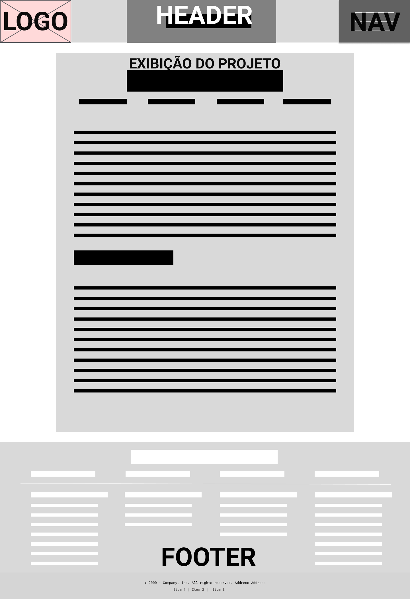
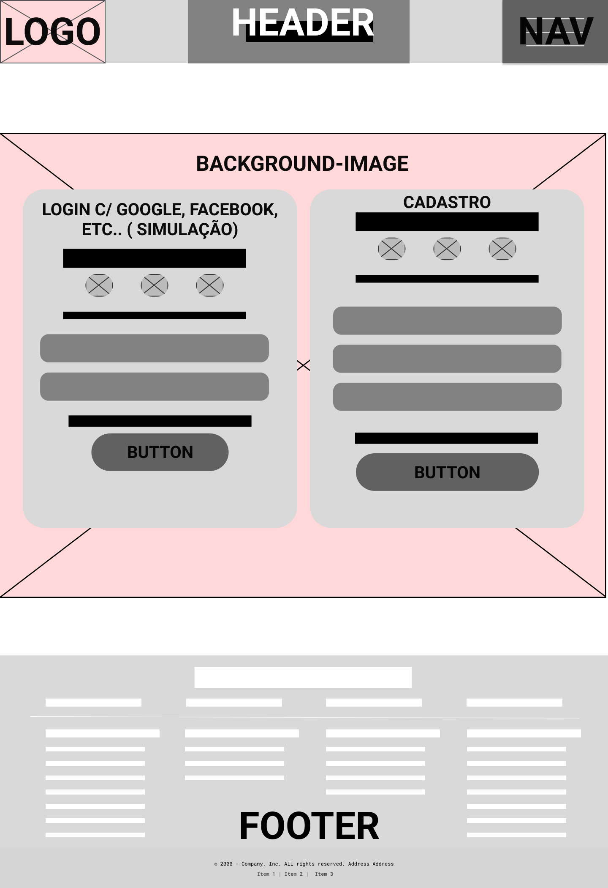
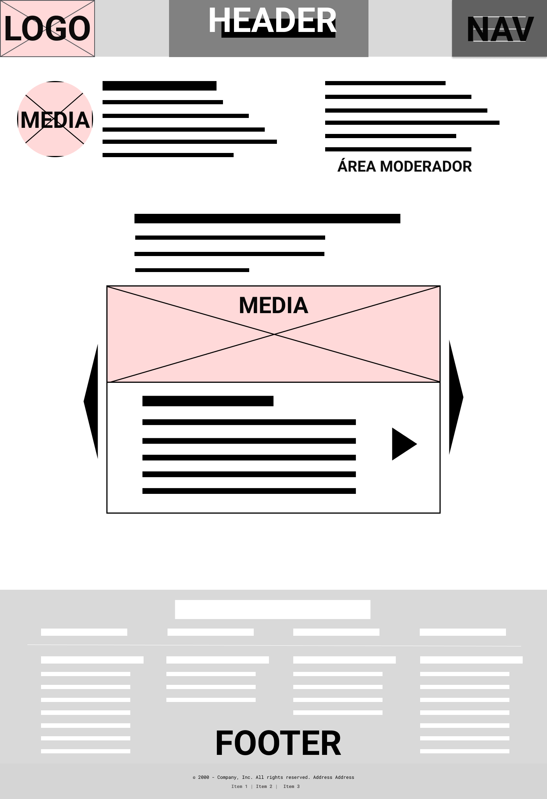
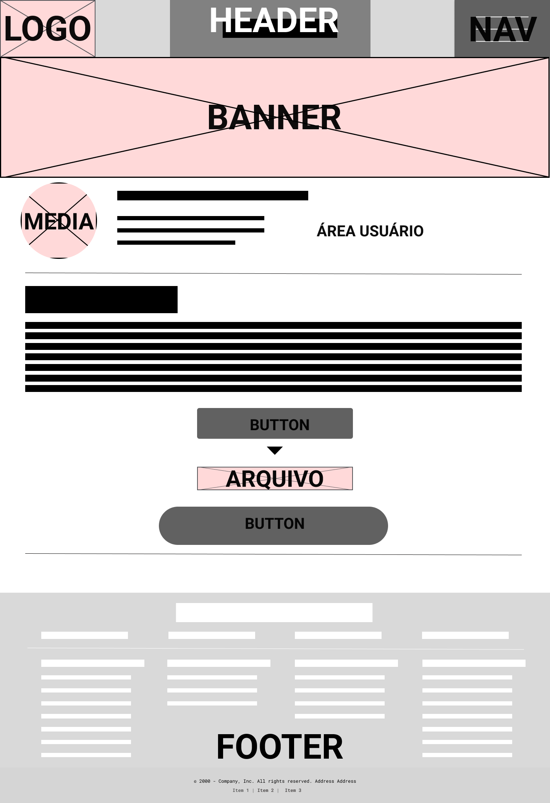
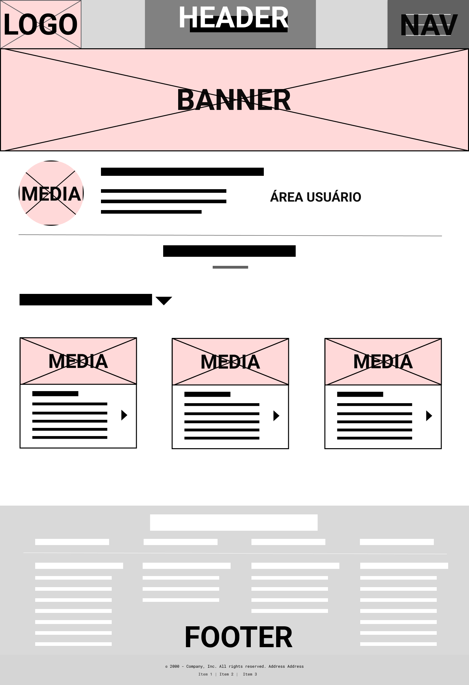
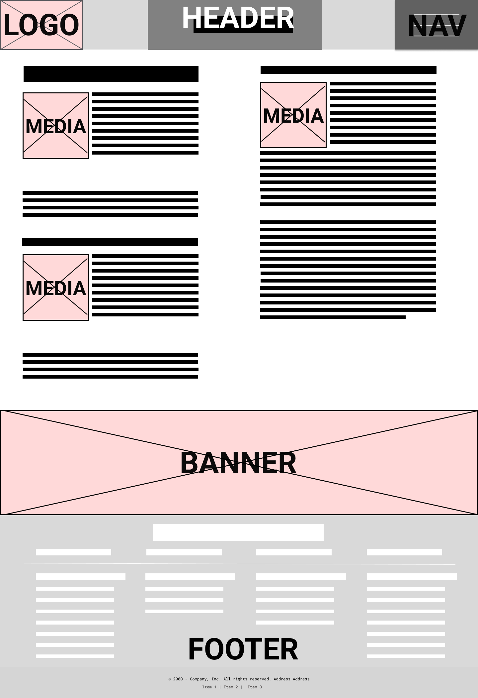

# Projeto de Interface

  

## Fluxo de Usuário da Aplicação

Este documento descreve as principais jornadas e interações dos usuários com a plataforma. O design do site permite que as principais funcionalidades, como visualização e envio de projetos, sejam acessíveis a todos os visitantes sem a necessidade de cadastro.

### 1. Exploração e Visualização de Projetos

Esta é a jornada fundamental de qualquer usuário que chega ao site.

1. O fluxo se inicia na **Página Home**, onde o visitante pode explorar os projetos em destaque ou utilizar a barra de busca (`Search Bar`).
2. Ao **clicar em um projeto**, o usuário navega para a **Página de Exibição do Projeto** para visualizar seus detalhes completos.

### 2. Envio de um Novo Projeto

Qualquer visitante, sem necessidade de cadastro, pode submeter um projeto para avaliação.

1. A partir do menu principal (`NAV`), o usuário **clica na opção 'Enviar Projeto'**.
2. Ele é direcionado para a **Página de Envio de Projeto**, onde preenche o título, descrição, anexa arquivos e outras informações pertinentes.
3. Ao finalizar, ele **submete o formulário para moderação**. O projeto entra em uma fila de aprovação e não fica público imediatamente.

### 3. Gerenciamento de Projetos Favoritos

A funcionalidade de favoritar projetos está disponível para todos e utiliza o armazenamento local do navegador, não exigindo uma conta de usuário.

1. Durante a navegação, o usuário pode clicar em um ícone para marcar um projeto como favorito.
2. Para ver sua lista salva, ele acessa a **Página de Favoritos** através de um link no menu principal.

### 4. Fluxo Exclusivo do Moderador

Este é o único fluxo que exige autenticação e é restrito a usuários com permissões de administração.

1. O Moderador utiliza a **Página de Login/Cadastro** para se autenticar no sistema.
2. Após o login bem-sucedido, o sistema o redireciona automaticamente para a **Área do Moderador**.
3. Nesta página, ele visualiza a lista de projetos pendentes e toma uma decisão para cada um:
    * **Aprovar:** O projeto se torna público e passa a ser exibido na **Página Home**.
    * **Rejeitar:** O projeto é descartado do sistema.
    * **Revisão:** O Projeto é tido como "necessário revisão" para corrigir eventuais erros ou incongruências.

---

## Protótipo de baixa fidelidade

As telas do sistema apresentam uma estrutura comum que é apresentada na figura a seguir. Nesta estrutura existem 3 grandes blocos:

* **Cabeçalho:** local onde estão dispostos o nome da aplicação web e navegação principal do site (menu da aplicação);
* **Conteúdo:** apresenta o conteúdo da tela em questão;
* **Rodapé:** apresenta informações sobre os direitos autorais.

  
   
  <i>Figura 2 - Estrutura padrão do site</i>

### 1. Página Home

**Descrição:** A página índice da aplicação. É a página inicial que usuários não logados acessam. Exibe um pequeno resumo do que a aplicação se trata e permite que o usuário se familiarize com as funcionalidades disponíveis.

**Funcionalidade:** Oferece acesso às principais seções do sistema e serve como ponto de partida para navegação.

  
   
  <i>Figura 3 - Página Home</i>

### 2. Página de Detalhes do Projeto

**Descrição:** Apresenta os detalhes completos de um projeto selecionado. Exibe atributos como título, descrição, autores e ano de publicação.

**Funcionalidade:** Permite visualizar as informações detalhadas do projeto e oferece a opção de download do conteúdo.

  
   
  <i>Figura 4 - Página de Detalhes do Projeto</i>

### 3. Página Login/Cadastro

**Descrição:** Oferece um formulário para login e cadastro de novos usuários, com opções para recuperação de senha.

**Funcionalidade:** Permite o acesso a funcionalidades exclusivas para usuários cadastrados e autenticados.

  
   
  <i>Figura 5 - Página Login/Cadastro</i>

### 4. Página Restrita (Moderador)

**Descrição:** Área restrita acessível apenas aos moderadores do sistema.

**Funcionalidade:** Os moderadores podem validar projetos, decidindo se eles devem ser aprovados ou rejeitados. Permite o gerenciamento e controle de conteúdo submetido pelos usuários.

  
   
  <i>Figura 6 - Página Restrita (Moderador)</i>

### 5. Página de Envio de Projeto

**Descrição:** Um formulário público onde os acadêmicos podem submeter seus projetos.

**Funcionalidade:** Permite o envio de projetos para registro e compartilhamento, preenchendo campos como título, descrição, mídia associada e arquivo do projeto.

  
   
  <i>Figura 7 - Página de Envio de Projeto</i>

### 6. Página de Favoritos

**Descrição:** Permite que os usuários visualizem todos os projetos marcados como favoritos.

**Funcionalidade:** Facilita o acesso rápido a documentos de interesse previamente marcados, permitindo que o usuário retorne a conteúdos importantes.

  
   
  <i>Figura 8 - Página de Favoritos</i>

### 7. Página de Recomendações de Ferramentas

**Descrição:** Contém informações úteis, tutoriais e ferramentas para auxiliar os acadêmicos na criação e aprimoramento de projetos.

**Funcionalidade:** Divulga recomendações, tutoriais e outras informações relevantes para melhorar o desenvolvimento dos projetos.

  
   
  <i>Figura 9 - Página de Recomendações de Ferramentas</i>

---
## Considerações Finais
Os protótipos foram desenvolvidos visando clareza, acessibilidade e funcionalidade, com um layout que prioriza a usabilidade e navegação intuitiva.

---

2025 - Projeto Estúdio de Ideias - PUC Minas

