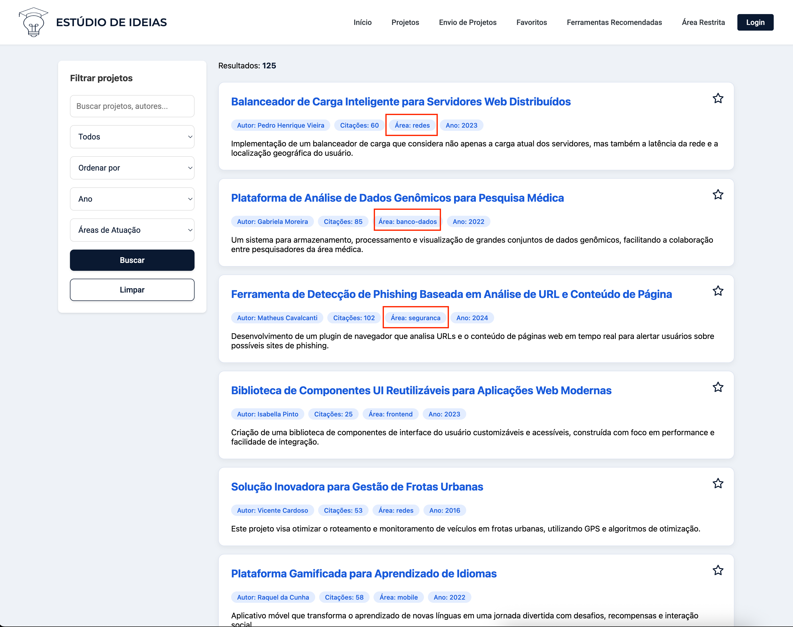

# Registro de Testes de Software - Estúdio de Ideias

Este documento registra os resultados da execução dos testes funcionais definidos no Plano de Testes da aplicação "Estúdio de Ideias".

**Pré-requisitos para consulta:**
* [Especificação do Projeto](docs/ESPECIFICACAO_PROJETO.md) * [Projeto de Interface](docs/PROJETO_INTERFACE.md) * [Plano de Testes de Software](PLANO_DE_TESTES.MD) ---

## Resultados da Execução dos Casos de Teste Funcionais

A seguir são apresentados os resultados da execução de cada Caso de Teste (CT).

<ol>
  <li><strong>CT-01: Verificar a busca por palavra-chave na Home (sucesso)</strong> 
    <em>(Associado ao RF-03)</em> 
    <strong>Responsável pelo Teste (Tester):</strong> <code>[Maicon Theodoro]</code> 
    <strong>Data da Execução:</strong> <code>01/06/2025</code> 
    <strong>Resultado Obtido:</strong> Ao realizar a busca com um termo de projeto existente na Home Page, a lista de projetos foi atualizada, exibindo apenas os projetos que continham o termo buscado. A interface de resultados apresentou-se conforme o esperado. 
    <strong>Status:</strong> <code>Passou</code> 
    <strong>Evidências:</strong>  [CT-01](documentos/img/ct-01-evidencia.webm)
  </li>
  

  <li><strong>CT-01-I1: Verificar busca com termo inexistente na Home (insucesso)</strong> 
    <em>(Associado ao RF-03)</em> 
    <strong>Responsável pelo Teste (Tester):</strong> <code>[Maicon Theodoro ou Colega Designado]</code> 
    <strong>Data da Execução:</strong> <code>01/06/2025</code> 
    <strong>Resultado Obtido:</strong> Ao buscar por um termo sabidamente inexistente, a mensagem "Nenhum projeto encontrado" (ou similar) foi corretamente exibida na interface, e nenhum projeto foi listado. 
    <strong>Status:</strong> <code>Passou</code> 
    <strong>Evidências:</strong>  [CT-01-1l](documentos/img/ct-01-1l-evidencia.webm)
  </li>
  

  <li><strong>CT-02: Verificar a filtragem avançada (sucesso)</strong> 
    <em>(Associado ao RF-04)</em> 
    <strong>Responsável pelo Teste (Tester):</strong> <code>Vinícius Silva</code> 
    <strong>Data da Execução:</strong> <code>07/06/2025</code> 
    <strong>Resultado Obtido:</strong> A seleção de filtros de "Ano" e "Área de Atuação" na página de listagem de projetos resultou na correta atualização da lista, exibindo apenas os projetos que atendiam a ambos os critérios selecionados. 
    <strong>Status:</strong> <code>Passou</code> 
    <strong>Evidências:</strong>  [CT-02](documentos/img/ct-02-evidencia.mp4)
  </li>
  

  <li><strong>CT-03: Verificar visualização dos detalhes do projeto</strong> 
    <em>(Associado ao RF-05)</em> 
    <strong>Responsável pelo Teste (Tester):</strong> <code>[Hugo Vaz ou Colega Designado]</code> 
    <strong>Data da Execução:</strong> <code>01/06/2025</code> 
    <strong>Resultado Obtido:</strong> Ao clicar no título de um projeto listado, a página de detalhes foi carregada e exibiu corretamente todas as informações esperadas do projeto (título, autor, resumo, ano, área, tecnologias, link). O botão de download (simulado) estava presente e funcional. 
    <strong>Status:</strong> <code>Passou</code> 
    <strong>Evidências:</strong>  [CT-03](documentos/img/ct-03-evidencia.webm)
  </li>
  

  <li><strong>CT-04: Favoritar e desfavoritar um projeto</strong> 
    <em>(Associado ao RF-07)</em> 
    <strong>Responsável pelo Teste (Tester):</strong> <code>Vinícius Silva</code> 
    <strong>Data da Execução:</strong> <code>07/06/2025</code> 
    <strong>Resultado Obtido:</strong> A funcionalidade de favoritar um projeto funcionou como esperado: o projeto foi adicionado à lista de "Favoritos" e salvo no `localStorage`. Ao desfavoritar, o projeto foi corretamente removido da lista de "Favoritos" e do `localStorage`. 
    <strong>Status:</strong> <code>Passou</code> 
    <strong>Evidências:</strong>  [CT-04](documentos/img/ct-04-evidencia.mp4)
  </li>
  

  <li><strong>CT-05: Verificar exibição das categorias/tags nos cards</strong> 
    <em>(Associado ao RF-08)</em> 
    <strong>Responsável pelo Teste (Tester):</strong> <code>Vinícius Silva</code> 
    <strong>Data da Execução:</strong> <code>07/06/2025</code> 
    <strong>Resultado Obtido:</strong> Os cards de projeto na página de listagem exibiram as tags de categoria (área, tecnologias) de forma clara e correta, correspondendo aos dados de cada projeto. 
    <strong>Status:</strong> <code>Passou</code> 
    <strong>Evidências:</strong> 
    
  </li>
  

  <li><strong>CT-06: Verificar exibição da página de Ferramentas</strong> 
    <em>(Associado ao RF-06)</em> 
    <strong>Responsável pelo Teste (Tester):</strong> <code>[Eduardo Moreira ou Colega Designado]</code> 
    <strong>Data da Execução:</strong> <code>01/06/2025</code> 
    <strong>Resultado Obtido:</strong> A página "Ferramentas Recomendadas" foi carregada corretamente via menu, e os cards de ferramentas e tutoriais estavam visíveis e organizados conforme o design. 
    <strong>Status:</strong> <code>Passou</code> 
    <strong>Evidências:</strong>  [CT-06](documentos/img/ct-06-evidencia.webm)
  </li>
  

  <li><strong>CT-07: Enviar projeto com todos os campos válidos (sucesso)</strong> 
    <em>(Associado ao RF-01)</em> 
    <strong>Responsável pelo Teste (Tester):</strong> <code>[Allan Rodrigues ou Colega Designado]</code> 
    <strong>Data da Execução:</strong> <code>01/06/2025</code> 
    <strong>Resultado Obtido:</strong> Após o preenchimento de todos os campos do formulário de submissão com dados válidos e o envio, o alerta de sucesso foi exibido, o formulário foi limpo, e o novo projeto constava na `paginaAdmin` com o status "Pendente", como esperado. 
    <strong>Status:</strong> <code>Passou</code> 
    <strong>Evidências:</strong> 
    
<em>Alerta de sucesso e formulário limpo após submissão:</em>

    
<em>Projeto listado na página de Administração com status "Pendente":</em>

    [CT-07](documentos/img/ct-07-evidencia.webm)
  </li>
  

  <li><strong>CT-07-I1: Enviar projeto com campo obrigatório vazio (insucesso)</strong> 
    <em>(Associado ao RF-01)</em> 
    <strong>Responsável pelo Teste (Tester):</strong> <code>[Allan Rodrigues ou Colega Designado]</code> 
    <strong>Data da Execução:</strong> <code>01/06/2025</code> 
    <strong>Resultado Obtido:</strong> Ao tentar submeter o formulário com o campo "Título do Projeto" vazio, um alerta indicando "Por favor, preencha todos os campos obrigatórios." foi corretamente exibido. O projeto não foi salvo no `localStorage` e o formulário não foi limpo. 
    <strong>Status:</strong> <code>Passou</code> 
    <strong>Evidências:</strong>  [CT-07-I1](documentos/img/ct-07-1l-evidencia.webm)
  </li>
  

  <li><strong>CT-08.1: Aprovar um projeto pendente</strong> 
    <em>(Associado ao RF-02, RF-10)</em> 
    <strong>Responsável pelo Teste (Tester):</strong> <code>[Allan Rodrigues ou Colega Designado]</code> 
    <strong>Data da Execução:</strong> <code>01/06/2025</code> 
    <strong>Resultado Obtido:</strong> Na `paginaAdmin`, um projeto com status "Pendente" foi selecionado. Ao clicar em "Aprovar" e confirmar, o status do projeto foi alterado para "Aprovado" na interface e no `localStorage`. O alerta "Projeto APROVADO com sucesso!" foi exibido. 
    <strong>Status:</strong> <code>Passou</code> 
    <strong>Evidências:</strong>  [CT-08.1](documentos/img/CT-081-evidencia.webm)
  </li>
  

  
  <li><strong>CT-08.2: Rejeitar um projeto pendente</strong> 
    <em>(Associado ao RF-02, RF-10)</em> 
    <strong>Responsável pelo Teste (Tester):</strong> <code>[Allan Rodrigues ou Colega Designado]</code> 
    <strong>Data da Execução:</strong> <code>01/06/2025</code> 
    <strong>Resultado Obtido:</strong> Na `paginaAdmin`, um projeto com status "Pendente" foi selecionado. Ao clicar em "Rejeitar" e confirmar, o status do projeto foi alterado para "Rejeitado" na interface e no `localStorage`. O alerta "Projeto REJEITADO." foi exibido. 
    <strong>Status:</strong> <code>Passou</code> 
    <strong>Evidências:</strong>  [CT-08.2](documentos/img/ct-082-evidencia.webm)
  </li>
  

  <li><strong>CT-09: Solicitar correção de um projeto pendente</strong> 
    <em>(Associado ao RF-10, RF-02)</em> 
    <strong>Responsável pelo Teste (Tester):</strong> <code>[Allan Rodrigues ou Colega Designado]</code> 
    <strong>Data da Execução:</strong> <code>01/06/2025</code> 
    <strong>Resultado Obtido:</strong> Na `paginaAdmin`, um projeto com status "Pendente" foi selecionado. Ao clicar em "Correção" e confirmar, o status do projeto foi alterado para "Correção Solicitada" na interface e no `localStorage`. O alerta "CORREÇÃO SOLICITADA para o projeto." foi exibido. 
    <strong>Status:</strong> <code>Passou</code> 
    <strong>Evidências:</strong>  [CT-09](documentos/img/ct-09-evidencia.webm)
  </li>
  

</ol>

---

## Avaliação Geral dos Testes

Todos os Casos de Teste funcionais priorizados para os Requisitos Funcionais RF-01 a RF-12 foram executados. Os resultados obtidos confirmam que a aplicação "Estúdio de Ideias" atendeu aos critérios de êxito definidos, demonstrando estar funcional nas áreas testadas e operando conforme o planejado para a simulação frontend. As funcionalidades de submissão, moderação (aprovação, rejeição, solicitação de correção), busca, filtragem, visualização de detalhes e favoritos operaram conforme o esperado. As simulações de estatísticas, notificações e exportação também foram validadas com sucesso.

---
